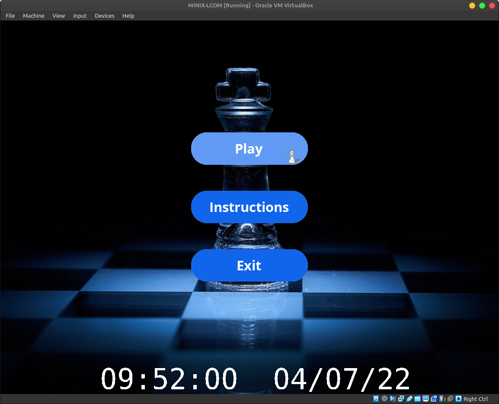
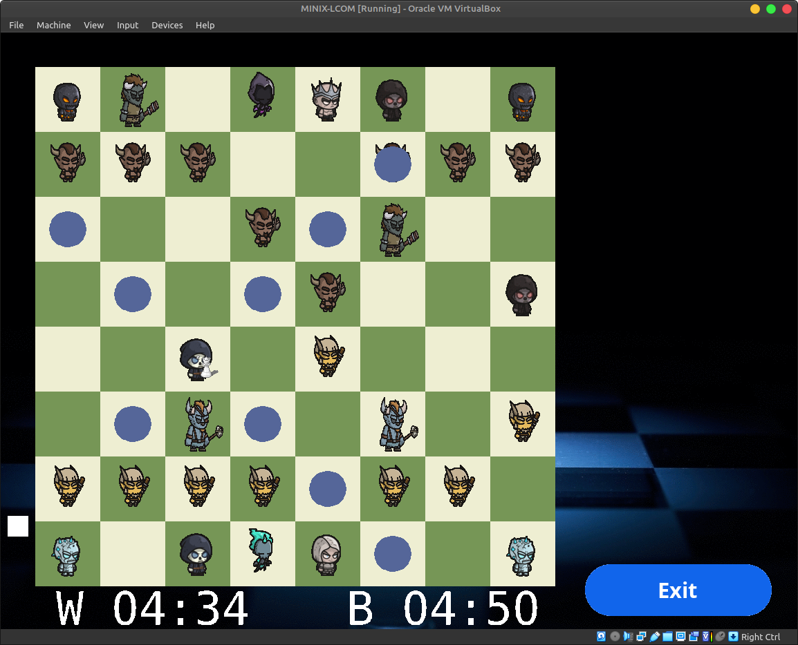

# LCOM Project

LCOM Project for group T13G7.

Animated Chess Game developed in C for Minix.

The project implements all taught device drivers:
- Timer
- Keyboard
- Mouse
- Graphics Card
- Real Time Clock
- Serial Port (UART)

## Demo Video

You can watch the gameplay demo at: https://www.youtube.com/watch?v=CgZbRUoOuT0

## Report

Learn more about the project in our extensive development [report](proj/doc/relatorio_t13g07.pdf)

## Group members:

1. Guilherme Freire (up202004809@fe.up.pt)
2. Marco André (up202004891@fe.up.pt)
3. Pedro Gomes (up202006086@fe.up.pt)
4. Ricardo Matos (up202007962@fe.up.pt)
